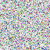
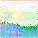
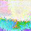
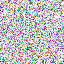

# ソースコードから理解するDiffusers

## 1. はじめに

AIに興味があるエンジニアや学生の多くは、Stable Diffusionのようなdiffusionモデルの仕組みについて、ある程度調べているのではないでしょうか。僕自身もその口で、いくつかの記事や論文を読むことで、「ノイズ画像を徐々にデノイズすることで画像を生成する」といった大まかな理解はしていました。

しかし、diffusionモデルを扱うオープンソースライブラリである[huggingface/diffusers](https://github.com/huggingface/diffusers)にコミットするためにコードを読み始めたところ、diffusionモデルで使われるU-NetやVAEなどについて、自分が全く理解できていないことを実感しました。

<br />

そこで、画像生成AIの内部動作やdiffusersライブラリをよりよく理解するために、PyTorchとtransformersのみを使用してテキストから画像を生成するシンプルなライブラリ「parediffusers」を開発することにしました。

この記事では、parediffusersを構築する過程で学んだことを共有し、Stable Diffusionの画像生成に関わる主要なコンポーネントとプロセスを説明します。経験豊富なAI開発者の方にも、これから始める方にも、Stable Diffusionのようなモデルがどのようにしてテキストから画像を生成するのか、その概要を理解していただければ幸いです。

<br />

　僕は専門家などではなく、ただAI技術が好きな学生のため、僕の理解に間違いがあるかもしれません。もしそのような間違いを発見された場合は、コメントなどでご指摘いただければ幸いです。

## 2. Diffusersを試す

まだDiffusersというライブラリを触ったことがない人のために、そのライブラリを使ってどのように画像を生成できるかを紹介します。Google Colabなどで試してみることができるので、diffusers使ったことがない人は是非動かしてみてください。

インストール：

```python
!pip install transformers diffusers accelerate -U
```

StableDiffusionPipelineを使って画像を生成する簡単な例を見てみましょう：

```python
import torch
from diffusers import StableDiffusionPipeline

device = torch.device("cuda")
pipe = StableDiffusionPipeline.from_pretrained("stabilityai/stable-diffusion-2").to(device)

prompt = "painting depicting the sea, sunrise, ship, artstation, 4k, concept art"
image = pipe(prompt).images[0]
display(image)
```


このコードでは、[Stability AI](https://stability.ai/)が開発した、Stable Diffusion 2.0をHugging Face Hubからダウンロードし、「painting depicting the sea, sunrise, ship, artstation, 4k, concept art(海、日の出、船、アートステーション、4K、コンセプトアートを描いた絵画)」というプロンプトを用いて画像を生成しています。

## 3. Pipelineを理解する

Diffusersで書かれている、StableDiffusionPipelineの実際のコードは[こちら](https://github.com/huggingface/diffusers/blob/main/src/diffusers/pipelines/stable_diffusion/pipeline_stable_diffusion.py)です。

このPipelineは以下のようなフローにまとめられます。

1. `encode_prompt` : テキストのプロンプトをembedding(テンソル)に変換する。
2. `get_latent` : 生成したい画像の、1/8のスケールでランダムなテンソルを生成する。
3. `denoise` : エンコードされたプロンプトのembeddingから、潜在空間を反復的にデノイズする。
4. `vae_decode` : デノイズされた潜在空間を画像にデコードする。

実際に、僕が開発したPareDiffusersのtext2imgでは、以下のようにして画像を生成しています。

https://github.com/masaishi/parediffusers/blob/035772c684ae8d16c7c908f185f6413b72658126/src/parediffusers/pipeline.py#L131-L134

それでは、各関数がどのような処理を行っているか、コードを見ながら見ていきましょう。

### 3.1. `encode_prompt`関数

プロンプトはテキストデータなのでモデルが扱えるデータに変換する必要があります。 そこで、`encode_prompt`関数により、プロンプトの意味を表すベクトル(embedding)に変換します。

Diffusersでは、[huggingface/transfomers](https://github.com/huggingface/transformers)から、CLIPTokenizerとCLIPTextModelをimportしていました。PareDiffusersでも同様に、その2つを用いて実装しています。

https://github.com/masaishi/parediffusers/blob/035772c684ae8d16c7c908f185f6413b72658126/src/parediffusers/pipeline.py#L41-L57

コードはとてもシンプルで、`get_embes`関数を使い、prompt_embedsとnegative_prompt_embedsに変換しています。シンプルにするために、negative_promptは空の文字列としています。

### 3.2. `get_latent`関数

`get_latent`関数は、拡散プロセスの開始点となるランダムな初期潜在テンソルを生成します。

https://github.com/masaishi/parediffusers/blob/035772c684ae8d16c7c908f185f6413b72658126/src/parediffusers/pipeline.py#L59-L65

上記のコードからわかるように、潜在テンソルのサイズは[batch_size, 1, width // 8, height // 8]です。つまり、生成したい画像サイズの1/8のスケールにすることで、訓練時の計算量を削減しています。

<br />
このコードで生成されるlatentは、以下のような画像です。



### 3.3. `denoise`関数

`denoise`関数は拡散プロセスの中核をなすものです。この関数は、指定されたタイムステップ数にわたって潜在空間を反復的にデノイズします。各タイムステップにおいて、UNetモデルを使用してノイズ残差を予測し、予測されたノイズを減算することで潜在空間を更新します。デノイジングプロセスは、エンコードされたプロンプトの埋め込みによってガイドされます。

https://github.com/masaishi/parediffusers/blob/035772c684ae8d16c7c908f185f6413b72658126/src/parediffusers/pipeline.py#L67-L93

67=73行目で、timestepsを返す関数`retrieve_timesteps`を定義しています。この関数で使われている`scheduler`については、4. DDIMSchedulerで詳しく説明します。ここで重要なのは、3.1で説明したprompt_embedsと、3.2で生成した初期潜在テンソルを引数として渡していることです。

恥ずかしい話ですが、実際にコードを書く前は、プロンプトの情報をどこで使っているかを、僕は把握していませんでした。しかし、コードを書いてみることで、prompt_embedsが1回だけ使われるのではなく、デノイズループのたびに使われることがわかりました。

<br />

`denoise`関数では、timestepsの数だけループを回しています。
その中の86行目で、UNetモデルを使ってノイズ残差を予測しています。UNetモデルは、5. UNet2DConditionModelで詳しく説明します。

88行目で、text_cond_residualとuncond_residualの差に、guidance_scaleを掛けることで、入力テキストをどの程度反映するかコントロールしています。 guidance scaleが、生成画像にどのような効果を及ぼすかは、[Guide to Stable Diffusion CFG scale (guidance scale) parameter](https://getimg.ai/guides/interactive-guide-to-stable-diffusion-guidance-scale-parameter)という記事が参考になります。


| uncond_residual  | text_cond_residual |
| ------------- | ------------- |
|   |    |

<br />

各タイムステップでUNetモデルを使用してノイズ残差を予測し、潜在空間を更新しています。このプロセスにより、潜在空間が徐々にデノイズされ、最終的な生成画像が生成されます。


### 3.4. `vae_decode`関数

`vae_decode`関数は、デノイズされた潜在空間を受け取り、Variational Autoencoder (VAE) を使用して最終的な生成画像にデコードします。潜在空間はVAEのデコーダーに渡され、最終的に8倍に拡大された画像が生成されます。

https://github.com/masaishi/parediffusers/blob/035772c684ae8d16c7c908f185f6413b72658126/src/parediffusers/pipeline.py#L107-L115

実際のVAEはどのように実装できるかの解説は、6. AutoencoderKLで行います。

このコードを書いたときに、113行目のdenormalizeを行うことを忘れていました。VAEの訓練時に、画像データは正規化されているため、これを0-255の範囲に戻しています。

| Denoised latent  | VAE decoded image |
| ------------- | ------------- |
|   |    |

